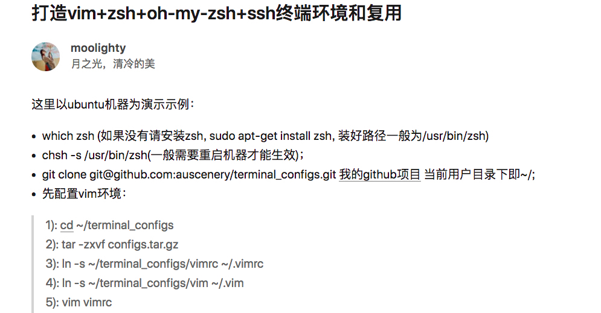
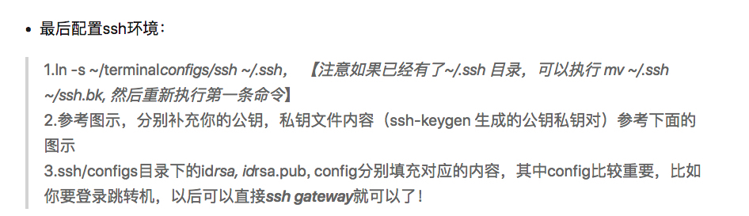
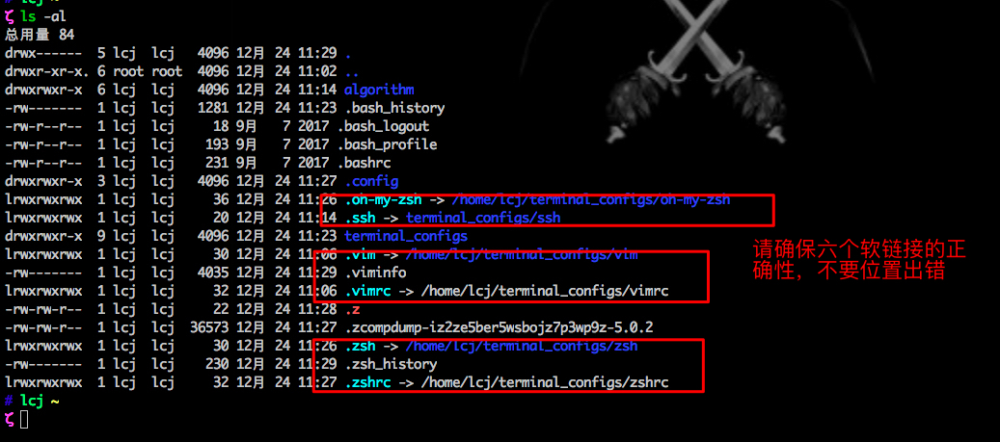

# vim + zsh + oh-my-zsh + ssh等配置文件, 主要方便在各台机器复用，方便自己保持统一编程风格
### 具体配置请参考我的知乎博客: [打造vim+zsh+oh-my-zsh+ssh终端环境和复用](https://zhuanlan.zhihu.com/p/53106094)
### 配置截图如下：

### config.tar.gz 主要包含有目录：oh-my-zsh, zsh, vim， 因为这三个项目都是github项目，打包是为了方便上传

